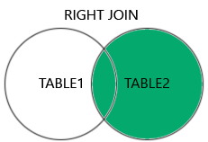

# Command line arguments

```c
#include <stdio.h>

int main(int argc, char* argv[])
{
    printf("total values -> %d\n", argc);
    for (int i = 1; i < argc; i++) {
        printf("%s\n", argv[i]);
    }
    return 0;
}
```

<figure><figcaption></figcaption></figure>
